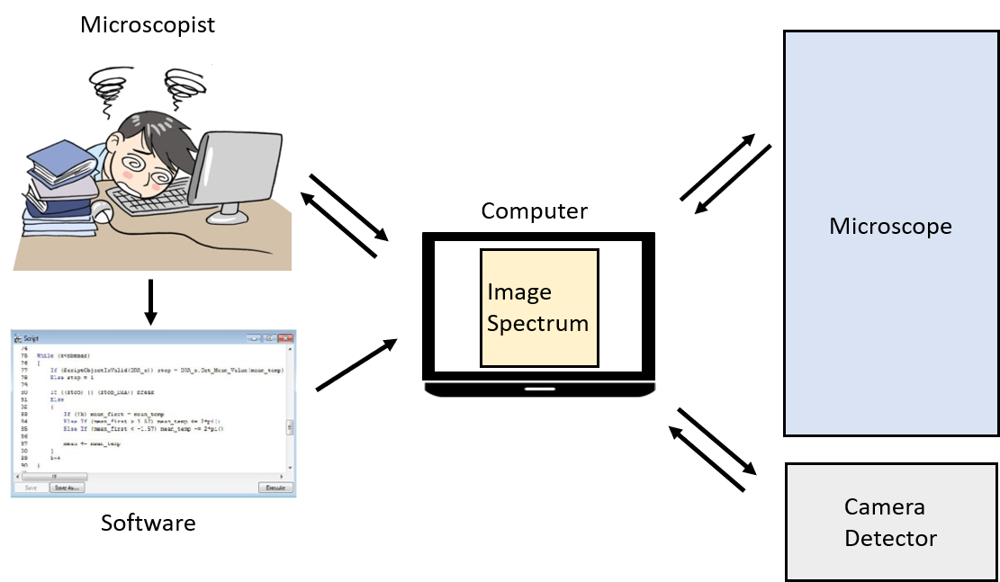

# Introduction

Electron microscopes have always been an active subject of research, in
particular with the advent of new instrumentation like brighter electrons
sources, sensitive cameras (direct electron detection), phase plate and vortex
beam, aberration corrector, high collection angle EDX detector. This continuous
instrumental development has also led to the emergence of new methods of
observation by original techniques.

In parallel of these instrumental and methodological developments, automation of
the electron microscope is a growing research area.

Automation can be defined as the fact of repeating one or more processes during
a defined or indefinite number of iterations, in an identical way or by varying
one or more parameters. These processes can be related to the acquisition and/or
processing of images, with or without the control of the microscope. If the
implementation of automation can be complex, the possibilities offered in terms
of measurement, time saving and flexibility are without comparison.

Algorithms were first developed for focusing and astigmatism correction, leading
to computer-assisted alignment of higher order aberrations for
spherical-aberration-corrected TEM. Automation was extended to acquire
tomographic tilt series for cryo-microscopy, diffraction tomography, and
holographic tomography, and recording images of many specimen areas and defocus
values for single-particle analysis in cryo-microscopy. Further refinements
include object displacement and focus prediction to accelerate acquisition of
tilt series for shorter acquisition and less beam induced damage , online
reconstruction of tilt series for preliminary inspection of data at the
microscope, alignment of individual particles in images to correct for beam
induced movement, and more recently, development of routine analysis pipeline
coupled with the acquisition, enabling complete sample-tailored automated
acquisition, including specimen selection. For these applications, automation
was developed to acquire a specific sequence of images (or datasets) under a
chosen set of experimental conditions; for example, beam tilt and defocus for
aberration correction, or sample tilt for tomography. High numbers of images can
be easily acquired without requiring any operator interaction, leaving human
errors and fatigue out of the loop. Thanks to the computer-controlled execution,
automated sequences can also reduce the time the specimen is exposed to
electrons, which is important for beam-sensitive materials. A large part of
automation TEM has thus been developed for biological material studies which
require low-dose observations.

## Aim

The purpose of this tutorial is to introduce you to the principle and some
concepts, and let you imagine what you could do next. In a more detailed way, we
will learn how to communicate with the microscope, obtain or modify one of its
parameters, understand what the microscope returns. Then we will see how to
launch a background thread before seeing what to do to reconstitute an image
from the beam spot. Finally, we will try to draw a circle with the beam spot and
then execute two threads at the same time.

6 tasks will be followed during this practical. 

## What we need

The automation for this practical requires different elements:
- a computer
- a software for scripting. If this software has image processing and
  acquisition functionalities, it becomes possible to automatize the recording
  and processing of images while modifying one or several elements of the
  microscope.
- a detector (camera)
- a connection to the microscope
- a communication protocol with the microscope

Here we will use Digital Micrograph (Gatan) (scripting, image acquisition and
communication with the microscope through the camera). Other software could be
used.

In the appendix are listed all generic functions (for all microscope models)
proposed by Digital Micrograph. The values of the variables are specific to each
microscope. You will note that many elements of the microscope are not
accessible (gun and imaging coils, intermediate and projector lenses,…) and that
probably some functions do not work depending on the microscope model or the
version of Digital Micrograph. To remedy this, you could develop the missing
functions yourself if the microscope manufacturer gives you access to the
communication protocol and an input. Some manufacturers have recently started
offering control functions for their microscopes.

In all the following tasks, we will only be interested in controlling the
position of the beam. But it is possible to modify many elements of the
microscope, individually or collectively (see appendix for others functions).

Before starting, please check that the Results window is open (in the menu:
Window -> Floating Windows -> Output and select the tab “Results”).
